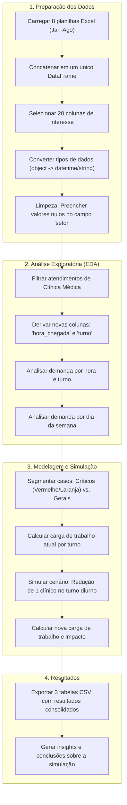

# Análise de Demanda e Simulação de Cenários - UPA
Análise da demanda de atendimentos da Clínica Médica de uma Unidade de Pronto Atendimento (UPA) e simula o impacto da redução de um clínico no turno diurno.
O trabalho foi desenvolvido em um Jupyter Notebook (`demanda.ipynb`) e serve como um estudo de caso prático para aplicação de técnicas de análise de dados com Python e Pandas.
## Objetivo da Análise
O principal objetivo é responder à seguinte pergunta:
> Qual seria o impacto na carga de trabalho dos médicos se a equipe do turno diurno fosse reduzida de 4 para 3 clínicos gerais?
## Estrutura do Repositório
```
/
├── data/
│   ├── raw/         # Contém as planilhas Excel originais (dados brutos)
│   └── processed/   # Contém os arquivos CSV gerados pela análise
├── demanda.ipynb    # Notebook com todo o código da análise
└── README.md        # Este arquivo
```

## Como Executar
1.  Clone este repositório: `git clone https://github.com/diogene5/analise-agosto25.git`
2.  Navegue até a pasta do projeto: `cd analise-agosto25`
3.  Certifique-se de ter as bibliotecas Python necessárias instaladas (principalmente `pandas`, `numpy` e `jupyter`).
4.  Abra o Jupyter Notebook: `jupyter notebook demanda.ipynb`
5.  Execute as células do notebook para reproduzir a análise.
## Fluxo da Análise
O diagrama abaixo ilustra as principais etapas do processo de análise de dados realizado no notebook.


