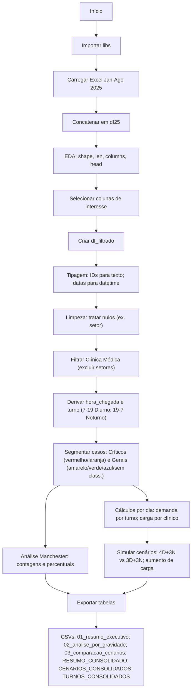

# Análise de Demanda UPA

Este repositório contém uma análise da demanda de atendimento na UPA, com foco na clínica médica.

## Fluxo da Análise

```mermaid
graph TD
  A["Início"] --> B["Importar libs"]
  B --> C["Carregar Excel Jan-Ago 2025"]
  C --> D["Concatenar em df25"]
  D --> E["EDA: shape, len, columns, head"]
  E --> F["Selecionar colunas de interesse"]
  F --> G["Criar df_filtrado"]
  G --> H["Tipagem: IDs para texto; datas para datetime"]
  H --> I["Limpeza: tratar nulos (ex. setor)"]
  I --> J["Filtrar Clínica Médica (excluir setores)"]
  J --> K["Derivar hora_chegada e turno (7-19 Diurno; 19-7 Noturno)"]
  K --> L["Segmentar casos: Críticos (vermelho/laranja) e Gerais (amarelo/verde/azul/sem class.)"]
  L --> M["Cálculos por dia: demanda por turno; carga por clínico"]
  L --> N["Análise Manchester: contagens e percentuais"]
  M --> O["Simular cenários: 4D+3N vs 3D+3N; aumento de carga"]
  N --> P["Exportar tabelas"]
  O --> P
  P --> Q["CSVs: 01_resumo_executivo; 02_analise_por_gravidade; 03_comparacao_cenarios; RESUMO_CONSOLIDADO; CENARIOS_CONSOLIDADOS; TURNOS_CONSOLIDADOS"]
```